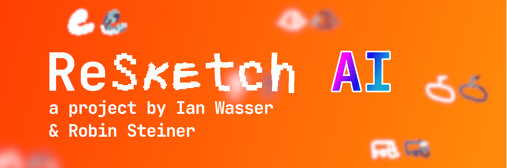

# ReSketch AI



## Abstrakt
ReSketch ist eine künstliche Intelligenz, die
Strichbilder nachzeichnen kann. Strichbilder sind beispielsweise Ziffern oder
Buchstaben. Die künstliche Intelligenz kann sich beim Zeichnen so bewegen, wie
es mit einem echten Stift möglich wäre. ReSketch funktioniert mit Deep
Q-Learning, einem Reinforcement Learning Modell. Das Modell basiert dabei auf
der Arbeit hinter Doodle-SDQ \cite{zhou_learning_2018}, erfährt aber
verschiedene Erweiterungen. Die Leistung von dem Modell wird durch vordefinierte
Kriterien evaluiert, deren Werte das Resultat dieser Arbeit ausmachen. ReSketch
erreicht eine Übereinstimmung von 90% zwischen der Vorlage und dem
nachgezeichneten Bild. Ausserdem kann die KI nach dem Training beliebige Arten
von Strichbildern nachzeichnen, obwohl diese lediglich auf das Zeichnen von
Zahlen trainiert ist. Eine zweite künstliche Intelligenz, die auf der
nachzeichnenden KI basiert, entfernt sich von der ursprünglichen Aufgabe. Diese
zweite KI erlernt das selbstständige Zeichnen von einem ausgewählten Motiv, ohne
eine Vorlage davon zu erhalten. Zu diesem Zweck werden die generierten
Zeichnungen der KI mit einem Klassifizierungsmodell bewertet. Mit einem
spezifischen Training dieser generativen KI können verschiedene Handschriften
emuliert werden.

[Vollständige Dokumentation](https://github.com/LarsZauberer/Nachzeichner-KI/releases/download/1.0/Maturarbeit_IanWasser_RobinSteiner.pdf)

## Resultate
### Bilder
#### Nachzeichnende KI
Base Variation:


Speed Variation:


#### Generative KI
Softmax Variation:


Random-Noise Variation:


### Tabellen
#### Nachzeichnende KI

Testen auf MNIST Datenset | 1000 Tests

|             | Sim [%] | Rec [%] | Speed | Drawtime [%] | Overdrawn |
|-------------|------------|------------|-------|-----------------|-----------|
| Base        | 90.8       | 97.1       | 54.7  | 0.73            | 269       |
| Rec         | 76.8       | 95.2       | 29.7  | 83.4            | 114       |
| Speed       | 80.2       | 96.7       | 20.5  | 90.5            | 78        |
| No-Penlift  | 79.7       | 96.4       | 20.8  | 0.981           | 97        |
| No-Overdraw | 83.3       | 97.3       | 36.3  | 54.5            | 40        |
| Physics     | 69.9       | 88.9       | 59.3  | 61.8            | 161       |

Testen auf EMNIST Letters Datenset | 1000 Tests

|             | Sim [%] | Rec [%] | Speed | Drawtime [%] | Overdrawn |
|-------------|------------|------------|-------|-----------------|-----------|
| Base        | 89.6       | 85.0       | 60.5  | 81.9            | 315       |
| Rec         | 76.6       | 76.6       | 45.2  | 86.4            | 201       |
| Speed       | 78.0       | 77.0       | 32.6  | 92.2            | 130       |
| No-Penlift  | 77.8       | 73.4       | 31.5  | 100             | 151       |
| No-Overdraw | 80.2       | 77.6       | 50.8  | 56.4            | 60        |
| Physics     | 67.9       | 57.2       | 61.0  | 74.7            | 190       |

Testen auf QuickDraw Datenset | 1000 Tests

|             | Sim [%] | Rec [%] | Speed | Drawtime [%] | Overdrawn |
|-------------|------------|------------|-------|-----------------|-----------|
| Base        | 81.8       | 93.7       | 56.5  | 73.9            | 227       |
| Rec         | 71.6       | 82.4       | 42.3  | 84.1            | 157.9     |
| Speed       | 74.5       | 85.7       | 29.5  | 89.3            | 93        |
| No-Penlift  | 72.7       | 84.4       | 28.1  | 99.0            | 114       |
| No-Overdraw | 78.8       | 89.2       | 44.3  | 62.8            | 57        |
| Physics     | 60.3       | 74.5       | 59.5  | 66.7            | 144       |

#### Generative KI

Testen der Softmax Variation | 1000 Tests

|       | Rec [%] | Speed | Drawtime [%] |
|-------|------------|-------|-----------------|
| Null  | 90.0       | 20.9  | 85.7            |
| Zwei  | 92.9       | 16.6  | 84.1            |
| Acht  | 83.9       | 37.6  | 75.4            |
| F     | 92.8       | 19.2  | 84.8            |
| Blume | 94.8       | 50.9  | 75.7            |

Testen der Random-Noise Variation | 1000 Tests

|       | Rec [%] | Speed | Drawtime [%] |
|-------|------------|-------|-----------------|
| Null  | 99.4       | 15.7  | 91.0            |
| Zwei  | 100        | 13.4  | 91.6            |
| Acht  | 99.4       | 17.0  | 93.0            |
| F     | 97.9       | 20.7  | 77.3            |
| Blume | 99.1       | 61.8  | 73.6            |

## Benutzungsanleitung

### Requirements

Tested Python Version 3.10.8 (Sollte auch auf tieferen Versionen laufen, aber nicht zu tief. :D)

Run:
```bash
pip install -r requirements.txt
```

um die Python Requirements zu installieren.


### Ausführen
Der Source Code ist im Ordner `src` zu finden.

Zum **Trainieren** kann man die Datei `train.py` ausführen. Der Parameter
`-h` zeigt noch weitere Konfigurationsmöglichkeiten an.

Zum **Testen** kann man die Datei `test.py` ausführen. Auch hier kann `-h`
weitere Konfigurationsmöglichkeiten anzeigen.

## Zitierung
```biblatex
@software{,
    title = "ReSketch AI",
    author = {Ian Wasser, Robin Steiner}
    date = {2022-10-11}
    url = {https://github.com/LarsZauberer/Nachzeichner-KI}
}
```
